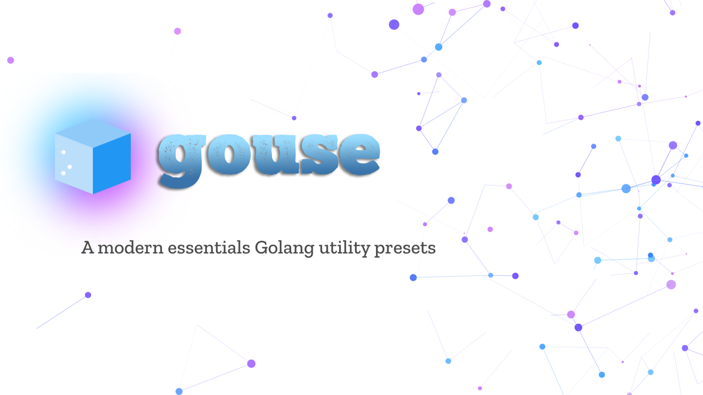

# Introduction



## 🧠 Why Gouse?

Gouse is a modern essential [`Golang`](https://golang.org/) utility package delivering consistency, modularity, performance, & extras presets inspired by [`Lodash`](https://lodash.com/).

- `Javascript` user-friendly syntax.

- No config - import as utility functions.

- Lightweight package: easy to use, chainable, and extendable, and available in various builds & module formats.

- Gouse provides a wide variety of available methods, taking the hassle out of working with arrays, numbers, objects, strings, etc. Each method has different features, so you can pick the ones that fit your project best.
- Comprehensive documentation and examples.
- Powerful package that is suitable for small to large projects and compatible with all OS platforms
- Thanks to Gouse, you can:

* Set up and scale projects rapidly.
* Handle complex logic use-cases such as database connection, build APIs, error handling, log management...
* Optimize performance and increase productivity.
* Build easily consistent systems with available functions.
* Avoid writing repetitive code and a unified code style.
* Reduce the number of lines of code and make it easier to read, understand, and maintain.
* Avoid compatibility conflicts and unexpected errors.
* And more...

## ✨ Motivation

- Go has emerged as a server language, but it still doesn't have complete and consistent packages available to support coding development.
  - Developers must write by hand or search manually. That wastes time and even causes many compatibility conflicts
  - Must update each dependent package every time you update
  - Unexpected errors can easily arise during execution
  - Performance is not optimized
  - The number of lines of code is very long that not easy to read and understand
  - Code logic may not be consistent, making it difficult to maintain and scale

👉 To address that need, Gouse was created as a powerful toolkit for Go developers, a collection of built-in functions and best practices that provide comprehensive, powerful, and reliable solutions. Trusted to build services, APIs, and web applications.

## 🚀 Features

✅ Array <br/>
✅ Cache <br/>
✅ Chart <br/>
✅ Config <br/>
✅ Connection <br/>
✅ Console <br/>
✅ Date <br/>
✅ Function <br/>
✅ Helper <br/>
✅ I/O <br/>
✅ Log <br/>
✅ Math <br/>
✅ Net <br/>
✅ Number <br/>
✅ Regex <br/>
✅ Struct <br/>
✅ String <br/>
✅ Tool <br/>
✅ Type <br/>

## 📋 Requirements

> Compatibility with Go >= **`1.18`**

## 📦 Installation

```go
go get github.com/thuongtruong109/gouse
```

## 🦄 Usage

- Using package directly in your module as ultra-lightweight utility functions.

```go
package main

import (
    "fmt"
    "github.com/thuongtruong109/gouse/math"
)

func main() {
    fmt.Println(math.Add(1, 2))
}
```

- View more examples at [`sample`](sample) folder.

## 📖 Documentation

- To read the completely package documentation guide, reference at [](https://pkg.go.dev/github.com/thuongtruong109/gouse)

- Refer to the [`Contributing Commands`](.github/CONTRIBUTING.md#commands) section for more information on how to develop the project.

## 📝 Contributing

- We welcome your contributions! If you're looking for issues to work on, try looking at the good first issue list. We do our best to tag issues suitable for new external contributors with that label, so it's a great way to find something you can help with!

- Please read our [`Code of Conduct`](../../.github/CODE_OF_CONDUCT.md) before contributing.

- Refer to the [`Contributing Guide`](../../.github/CONTRIBUTING.md) for more information on how to get started.

## 📌 Support

- The tool has been tested on a variety of inputs, but it's not perfect.
- For support in using Gouse, please reach out in the following venues:
  - [`Raise Issues`](https://github.com/thuongtruong109/gouse/issues/new) - For generally applicable issues and feedback.
  - [`Join Discussions`](https://github.com/thuongtruong109/gouse/discussions) - For ideas, questions, or issues regarding Gouse's design, development, and future.

## 📜 Changelog

- Gouse is under active development. This means that new features, bug fixes, and breaking changes will be released frequently. We encourage you to keep the [`CHANGELOG`](/CHANGELOG.md) open while upgrading to see what's new!

- For more information on how to use the changelog, please refer to [`Keeping a Changelog`](https://keepachangelog.com/en/1.0.0/).

## 📄 License

- Gouse is released under the [`MIT License`](/LICENSE). See the LICENSE file for more information.

- For more information, see the [`Licensing FAQs`](https://opensource.org/faq#mit-vs-bsd).
